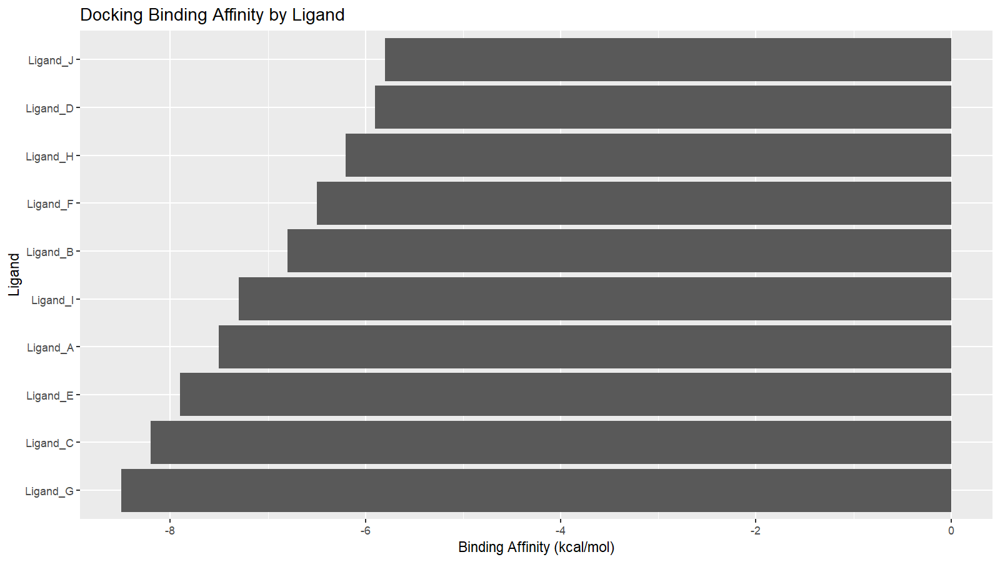

# molecular-docking-workflow
Reproducible R workflow for analysis of molecular docking results, including ligand ranking, binding affinity assessment, and visualization.

# Molecular Docking Analysis Workflow

## Overview
This project demonstrates a simplified molecular docking analysis workflow, focusing on the evaluation and interpretation of ligand binding affinity data.

## Methods
- Ranked ligands based on binding affinity
- Identified top candidate compounds
- Analyzed hydrogen bonding interactions
- Visualized docking scores using bar plots

## Tools
- R
- ggplot2
- dplyr

## Outputs

### Docking Score Plot

